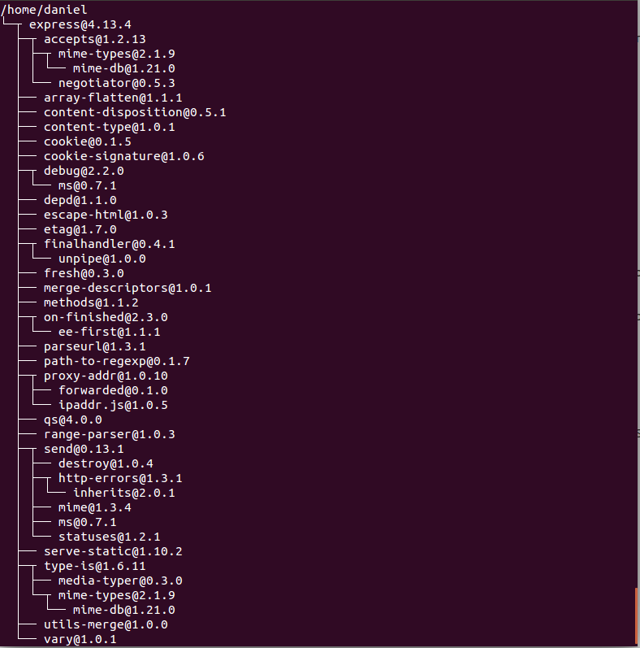
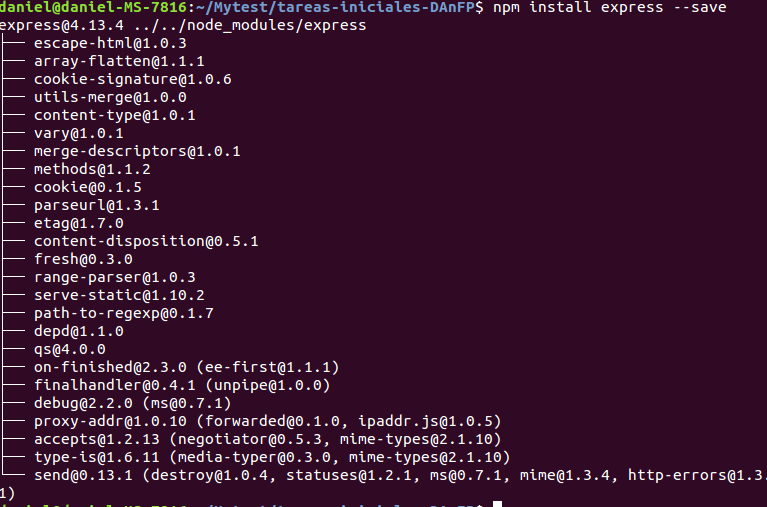

Tutorial NodeJS, Express, Atom, GitHub, Cloud9 y Markdown
======================================================

## Instalación de Git

**Git** es un software de control de versiones diseñado por [Linus Torvalds](https://es.wikipedia.org/wiki/Linus_Torvalds), pensando en la eficiencia y la confiabilidad del mantenimiento de versiones de aplicaciones cuando éstas tienen un gran número de archivos de código fuente.

Para instalar git en Linux, nos basta con ejecutar los siguientes comandos en la terminal:

**Comando**
> `sudo apt-get update`
> `sudo apt-get install git`

Para instalar git en Windows o Mac, nos tenemos que bajar el [instalador](https://desktop.github.com) e instalarlo como normalmente instalamos cualquier programa de windows o Mac, siguiendo los pasos que nos van saliendo.

## Instalación de Atom

**Atom** es un editor de código para OS X, Linux y Windows que soporta plug-ins escritos en Node.js, fue desarrollado por GitHub.

Para instalarlo tenemos dos formas:

-Ir a la [web de descarga](https://atom.io/) y descargar el paquete instalador.
-Ejecutar el comando en la terminal:
**Comando**
>  `sudo dpkg -i atom-amd64.deb`

##Cloud9

Es un IDE de desarrollo online, para su uso será necesario crear una cuenta en la página oficial o acceder con las credenciales de GitHub si ya se dispone de una cuenta. Una vez registrados podremos crear proyectos de varias tecnologías como puede ser NodeJS, HTML5, C++, Ruby On Rails, etc.

Una ves tengamos nuestra cuenta en cloud9 podremos vincularla con github, para ello vamos a **cloud9 > Account Settings > Connected Services** y nos deberia aparecer algo como esto:


Y le damos a **connect**.

## Node.js  

**Node.js** es un entorno en tiempo ejecución multiplataforma, de código abierto, para la capa del servidor, basado en el lenguaje de programación ECMAScript, asíncrono, con I/O de datos en una arquitectura orientada a eventos y basado en el motor V8 de Google. 

Una de las formas de install node.js es poniendo en la terminal de ubuntu:

**Comando** 
> `curl -sL https://deb.nodesource.com/setup_4.x | sudo -E bash -`
>`sudo apt-get install -y nodejs`

Y otra, la más clásica, descargandolo de la [web](https://nodejs.org/en/) para tu sistema operativo.

Una ves instalado comprobamos que funciona correctamente, ejecutamos el comando en nuestra terminal:

**Comando** 
>`npm ls`

Y nos muestra la siguiente imagen:



##Express

Es un framework de aplicaciones web de Node.js el cual aporta un conjunto de características web, incluidas aplicaciones web y su soporte.

Para instalarlo escribimos en la terminal:

**Comando** 
>`npm install express --save` 

Y nos saldrá algo como esto:



##Pandoc

**Pandoc** es un traductor que nos permite obtener ficheros en varios lenguajes, en nuestra práctica lo usuaremos para generar de Markdown a HTML.

Para instalar Pandoc ejecutamos el comando en nuestra terminal:

**Comando**
>`sudo apt-get install pandoc`

Para convertir de un fichero Markdown a html lo hariamos de la siguiente forma:

**Comando**
>`pandoc -o index.html index.md`

## Markdown

Markdown es un lenguaje de marcado ligero, lo vamos a utilizar en el editor de texto Atom ya que incorpora por defecto este formato y podremos obtener un live preview mientras vamos desarrollando además de poder exportarlo a HTML sin la necesidad de usar un conversor adicional.

Sintaxis:


Encabezados
```
# Encabezado H1
## Encabezado H2
### Encabezado H3
```
Tipografía
```
**Negrita**
*Cursiva*
> Citas
Parrafo separar por lineas en blanco
`Codigo`
```
Recursos
```

* [Links](https://example.com)
```
Listas
```
1. Lista 1
2. Lista 2

* Lista 1
* Lista 2
```

**Recursos:**

* [NodeJS](https://nodejs.org)
* [Express](http://expressjs.com)
* [Atom IDE](https://atom.io)
* [GitHub Desktop](https://desktop.github.com)
* [GitHub Pages](https://pages.github.com/)
* [Cloud 9 IDE](https://c9.io)
* [Markdown](http://daringfireball.net/projects/markdown/)
* [Resultado del Markdown HTML](http://alu0100536652.github.io/Tutorial-STW/)
